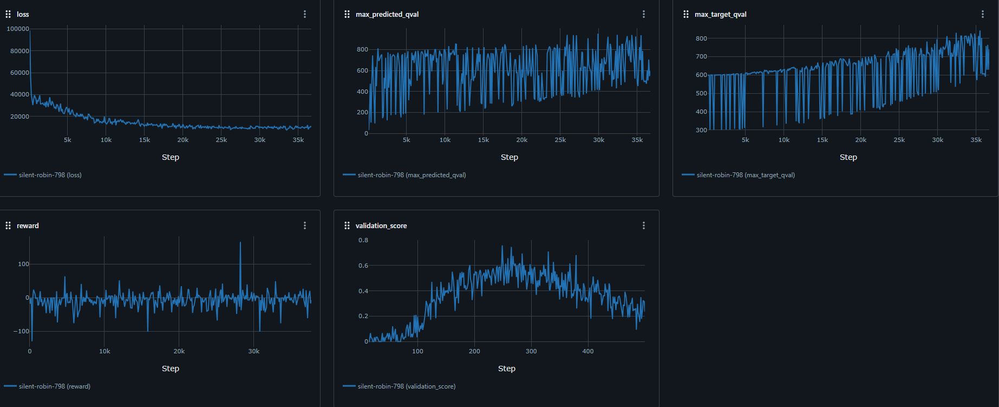

# FIT5226 Project: Dynamic Grid World Agent with DQN


Start fine-tuning with:
```bash
python scripts/finetune.py notebooks/a2/episode_250.pt
```

Monitor Training with:
```bash
mlflow ui
```

Evaluate it with:
```bash
python scripts/evaluate.py notebooks/a2/episode_250.pt
```

## Installation
```bash
pip install -e .
```

## Result
