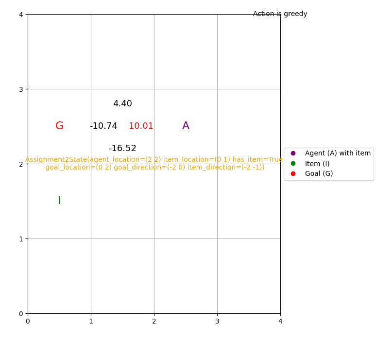

# FIT5226 Project: Dynamic Grid World Agent with DQN
A problem to let a DQN-based agent find the shortest path in various worlds, without using agent's path length as part of reward. Its task is to first collect an item and then reach a goal point.



## Training / Fine-Tuning
```bash
python scripts/finetune.py  configs/config.yml  # train
python scripts/finetune.py configs/config.yml checkpoints/{episode_x}.pt  # fine-tune
mlflow ui  # monitor training (automatically tracked when you run above command)
```

## Evaluation and Visualization
```bash
python scripts/evaluate.py configs/eval_config.yml checkpoints/{episode_x}.pt
```

## Hyper-Parameter Tuning
```bash
python scripts/hp_tune.py study_name
optuna-dashboard sqlite:///tuning_result.db  # monitor hyperparameter tuning
```

## Installation
```bash
git clone https://github.com/superleesa/fit5226_project.git
pip install -e .
```

## Result
Evaluation Score (ratio of agent-taken to optimal path length): 0.92648
See [configs/config.yml](configs/config.yml) for best hyper-parameters.
[final_checkpoints/2024-10-07_21-44-34-316970/checkpoint.pt/](final_checkpoints/2024-10-07_21-44-34-316970/checkpoint.pt/) is the corresponding checkpoint.

